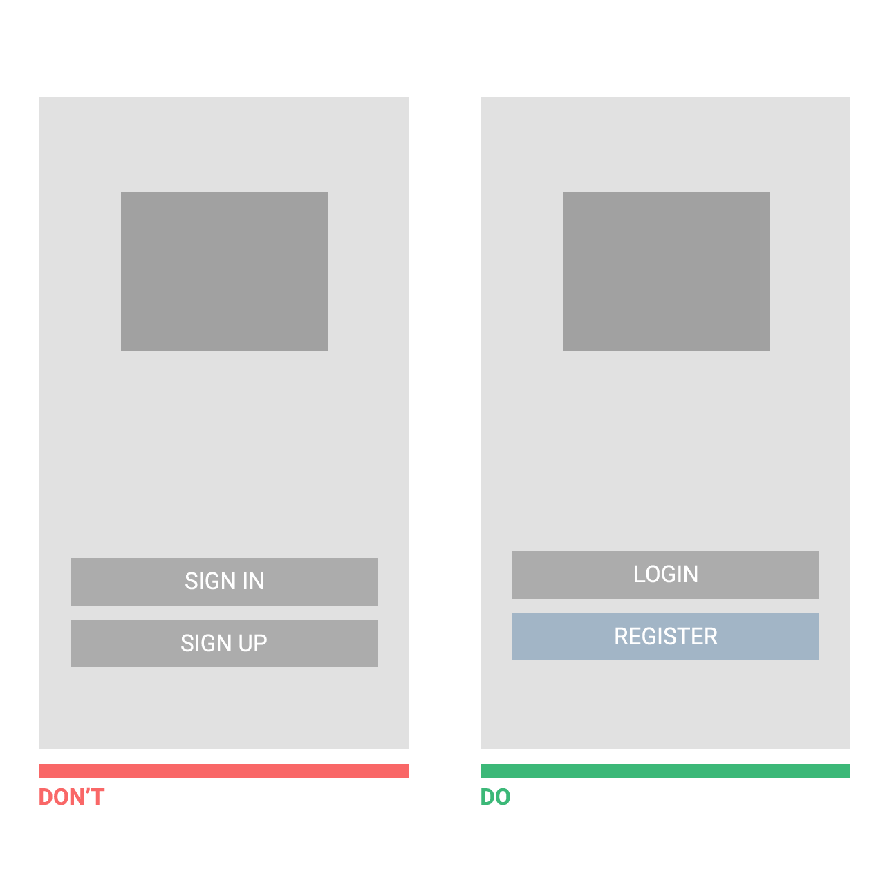
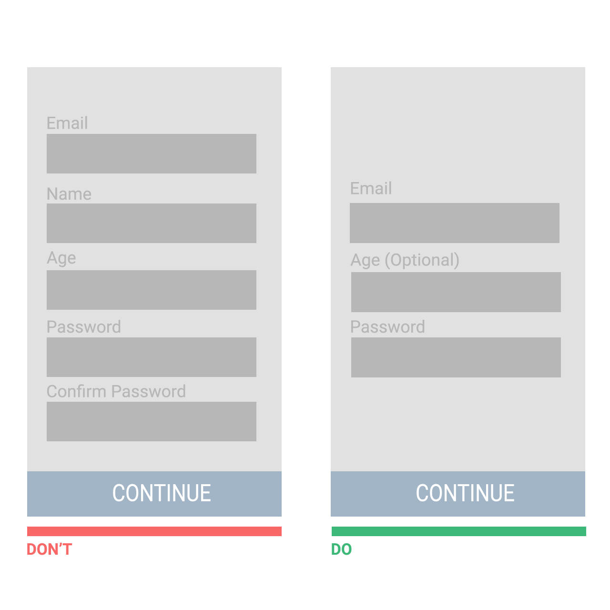
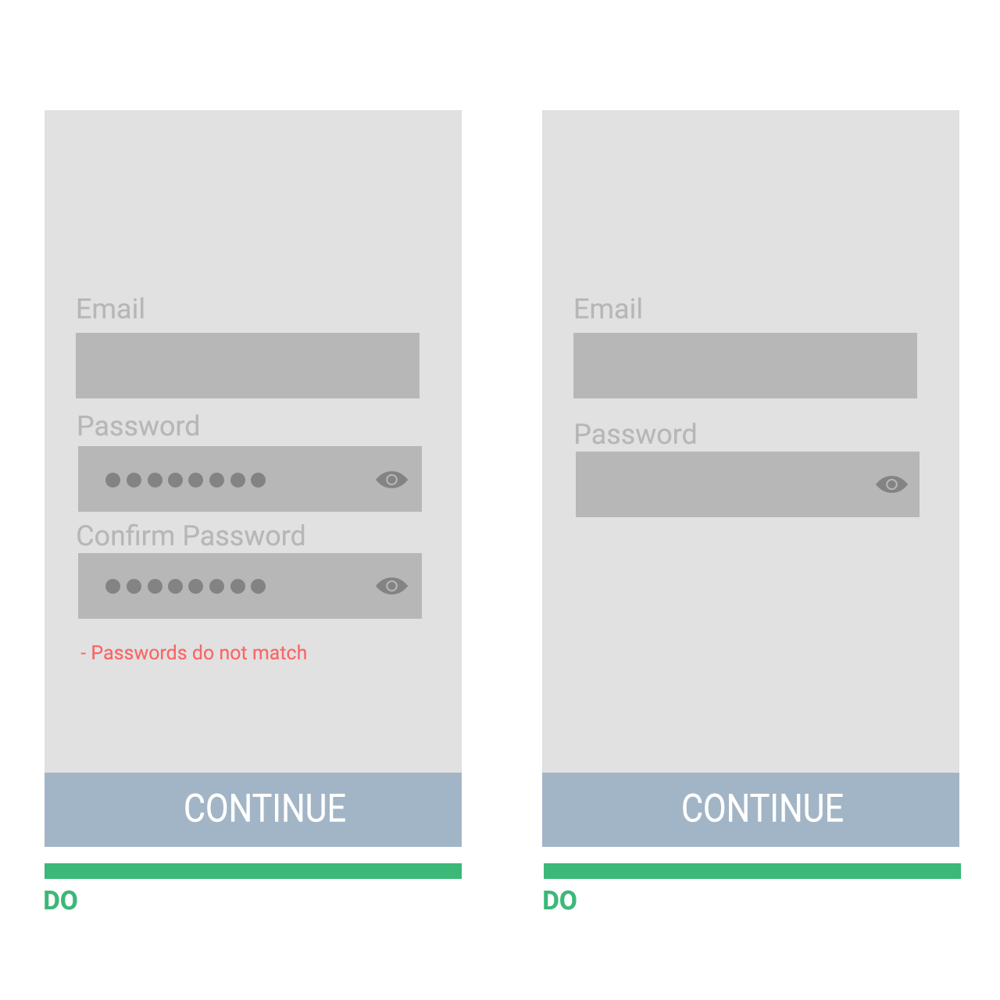
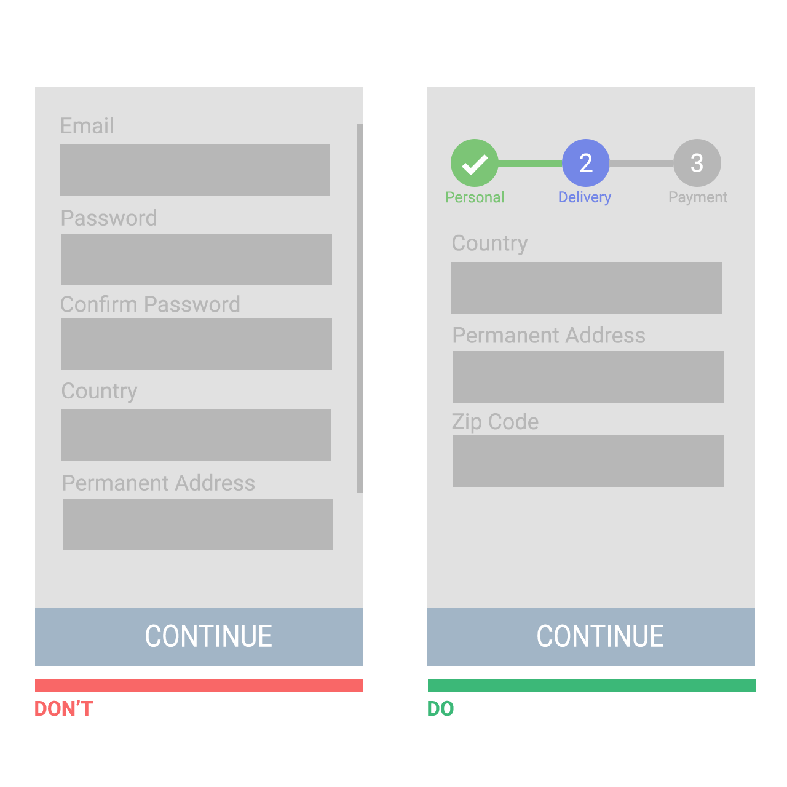
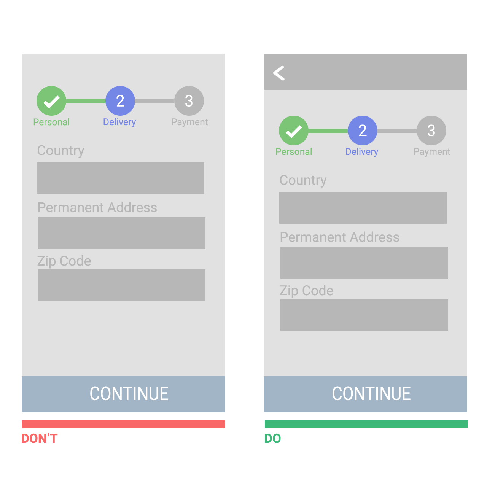

# Mobile App Design Principles

Mobile Apps are now mainstream and trusted way to deliver content and services. But in a vast market, how does a mobile app become relevant, valued, and useful so it delights and retain its users?

The goal of UX is to increase usability, not just in mobile applications, but in all things. This has been around even before mobile applications exist. The inability to use simple things like simply just opening a door is not 'Human Error', but the real culprit is faulty design. Designs who lack:
- Visibility
- Feedback
- Constraints
- Mapping
- Consistency
- Affordance

But don't get me wrong, usability may be key to a great application but having a great UI still matters. Studies shows that the more pleasing the interface is the more the user is forgiving when something goes wrong.

Want to really go deep into User Experience? I would highly recommend reading **Donald A. Norman's "Design of Everyday Things"**. This is the basis for Universal Design which Google's Material Design and others are using.

In this repository we'll talk about how to incorporate UX in your application from Registration up to the main functionalities of your application.

# Crafting an effective registration form

Registration is the most important part of your application. This gives the user an overview of your application's User Experience. As we all know first impressions are important, even more important in an application to retain it's users.
Though registration might be so common, there are still some issues that might may frustrate your users. Make sure your registration process isn't an obstacle to your users just by following these easy steps:

### 1. Don't use 'sign up' and 'sign in'

The problem is that 'sign up' and 'sign in' are looks quite similar. When buttons looks similar and use the same verb in their labels, users might get confused easily. User's might tap one instead of the other, frustrating the users who want to complete a specific task but instead redirected to the other. This happens because users quickly assume that the first call to action that catches their attention is the correct one.

Users shouldn't have to think what buttons they should tap. Make the button distinct from each other, highlight what new users commonly do which is register(Old users don't usually log out of the app so they most likely would not be in the landing screen). Use the labels 'Register' and 'Login' instead, you may combine 'sign in' and 'register' as labels as long as they are distinct verbs.

### 2. Eliminate as many fields as possible

The **fewer fields** a user see the less he/she, would likely abandon the process. Ask the minimum to get the users started, you could always ask further information along the way. There is no point in wasting the user's time, try considering what information you should absolutely must gather.
- Registrations can eliminate double input for password and email fields. There are better ways to asses typos (see section 3).
- It is better to have no optional fields. As I said you can always ask the user further information along the way. Don't waste the user's time. But assuming you really need the optional field in your registration screen, make sure you clearly highlight them.

### 3. Let user's see their password

A problem that frustrates users during login and registration is mistyping a password. This is common due to password fields are usually masked for security reasons. Always assume that the user often mistype, especially that it is used in a mobile device.

Assuming that you are using double entry password, provide a direct feedback about the user's mistyping. Don't wait for the user to press a button and then provide feedback about the user's typo.

### 4. Break up long registration processes into steps

For many ecommerce apps, the registration process might require a bigger time investment and this might be generate more opportunities for the user to get frustrated. Use **Progress Indicators**, Progress Indicators (or sometimes called progress trackers) display a user's progress through a sequence by breaking it up into multiple number of steps logically. They guide the user to complete a specific task.    Progress Indicators inform the user the following:

- What steps(or tasks) they have already completed
- Which step the user is currently on.
- How many steps still remain

Studies show that offering users a clear idea of how many steps it takes to get to the final target can significantly reduce abandonment. From the psychological point of view, this makes a lot of sense. If you know how many steps you must complete, the more likely to complete the process.

Studies show that letting users have a clear idea of how many steps it takes to complete a task can significantly reduce frustration and abandonment. From a more psychological point of view this makes a lot of sense since you know how many steps you must undergo, you're more likely to complete the task.

### 5. Allow users to go back a step easily

Users may want to go back one step as they use the app. Apps should incorporate back functionality so that users won't be forced to start over. Allowing users to go back one step in the process eliminates the frustration of any inadequate workarounds.

# Main Features

### Be straight-forward with your app

Address tasks clearly and straight-forward. Place call to actions up front and center. Highlight your app's key and new features in appropriate places so there will be no frustration and confusion.
